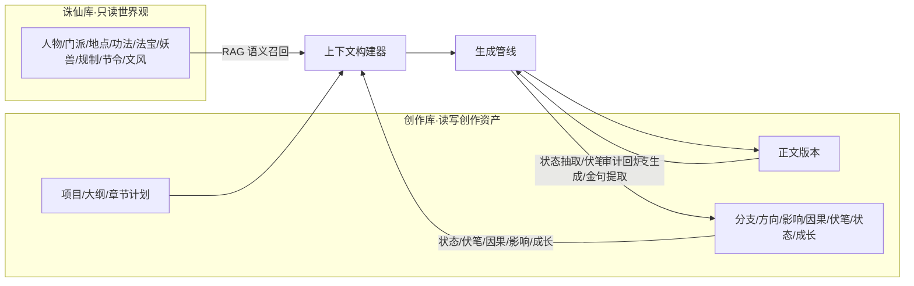
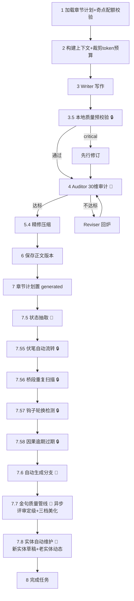
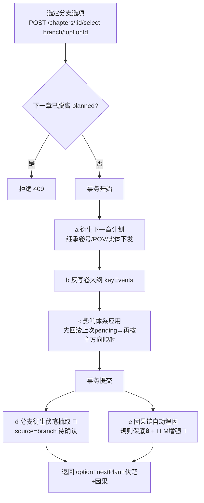
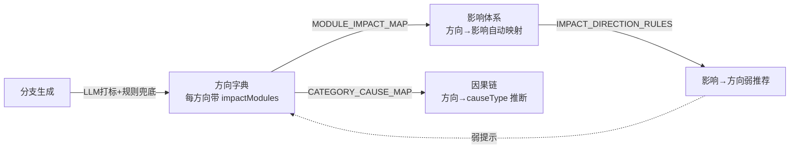

# 指尖仙侠（XianxiaForge）功能手册

> 版本：v1.5.1 ｜ 更新日期：2026-08-07
> 定位：本地化部署的 AI 长篇小说创作工具（多智能体管线 + 作者主权 + 确定性兜底）
> 文档性质：产品/内部功能全景手册——逐模块列出全部功能点、入口、规格与关联关系
> 配套文档：《指尖仙侠 技术手册》（架构/表结构/接口实现细节）、《PPT 大纲》（对外汇报）

**阅读约定**

- 「入口」列标注功能的前端页面与后端接口；接口路径省略 `/api` 前缀。
- 「关联」列标注该功能触发或被哪些功能消费，详细链路见 §2 关系图与 §4 关联矩阵。
- 凡标注 **best-effort** 的功能，失败时一律降级为空、绝不阻断主流程（见 §5.4 降级红线）。
- 图例：★ = 核心技术亮点；🔒 = 确定性规则零 LLM；🤖 = 需调用 LLM。

---

## 1. 功能全景总览

系统按四条产品线组织，共 30 个功能模块：

| 产品线 | 模块 | 说明 |
|---|---|---|
| **A 创作主线** | 1 项目与仪表盘 | 项目 CRUD、创作统计、数据驾驶舱、**新书引导向导**（6步全屏，v1.5.1新增） |
| | 2 世界观百科 | 诛仙库实体图鉴/宗门规制/岁时节令/文风引擎（RAG 数据源） |
| | 3 大纲与场景脚本 | 卷大纲、章节计划、场景节点拖拽编排 |
| | 4 章节生成管线 ★ | 多 Agent 写作流水线 + 任务队列 + SSE 流式 |
| | 5 章节阅读与编辑 | 正文阅读/编辑/版本/对话修订/视角重写；右栏双Tab（剧情分支｜章节分析），词频/文风/审计/润色内联右栏（v1.5 工具栏优化） |
| **B 叙事工程** | 6 剧情分支系统 ★ | 章间走向选项生成与选定 |
| | 7 剧情方向体系 ★ | 10 大类 41 方向字典、打标、统计、校验 |
| | 8 影响体系 ★ | 影响定义/快照/预览/应用/历史 |
| | 9 因果链 | 因果线生命周期与自动埋因 |
| | 10 伏笔台账 | 伏笔全生命周期 + DNA 校验 + 回填 |
| | 11 全局状态追踪 | 人物状态快照 + 时间线里程碑 |
| | 12 成长弧光 | 人物成长阶段卡点 |
| | 13 成长工坊 | 法宝融合·变异·强化·进化（旧功法页签已退役→模块23） |
| | 14 人物关系推演 | 自定义关系 + AI 关系走向推演 |
| | 28 动态叙事引擎 ★ | 里程碑驱动大纲 + 分支弧管理 + 自动收敛引擎 + 计划改写日志（v1.4 新增） |
| | 29 双引擎工坊 ★ | 冲突引擎（欲望→阻力→代价）× 冰山台词引擎（真相→表面→行为）+ 组合成戏 + 质量体检 + 大纲联动预填（v1.5 新增） |
| **C 质量防线** | 15 质量审计闭环 ★ | 30 维审计 + 六层修订 + 回炉循环 + 一键修改 |
| | 16 文风与去 AI 味 ★ | 文风引擎 + 8 型 AI 味分型 + 本地零 token 扫描 |
| | 17 叙事体检 | 9 维全书健康度扫描 |
| **D 素材与配置** | 18 剧情素材库 | 四类素材语义召回（奇遇/伏笔手法/高光/任务链） |
| | 30 对标素材库·拆文 ★ | 轻量拆文（粘贴原文→LLM拆四类资产）+ 整本拆文（上传TXT→逐章拆骨架/情节，v1.5.1新增）+ 置顶强制融入 + 写作自动召回 |
| | 19 金句·名场面 ★ | 金句收藏 + 批量导入 + 人物感知注入 + 五维评审/三档美化/回写正文（v1.3 升级） |
| | 20 系统设置 | LLM 配置、默认生成参数、数据库状态 |
| | 21 自定义人物工坊 | 三步向导捏人 + 先天禀赋（3-8正向/每类≤2/23选1小缺陷）+ AI 判词 + 一键补全对白风格（v1.4） |
| | 22 神兵坊 | 自定义武器锻造 + 方向组合式特质系统 + 五感兵器卡 + 强化/进化/变异/融合养成 |
| | 23 自定义功法坊 ★ | 九大道则体系 + 确定性随机锻造 + 千人千面个人变种 + 配套招式 + 武学档案融合小传 |
| | 24 热点嗅探 | 抓热门榜单 → LLM 提炼剧情灵感 → 推送入剧情素材库 |
| | 25 素材知识库 | 灵感素材库（plot_material_*+benchmark统一展示，v1.5.1合并）/ 文风预设 / 领域知识 / 拆文工具（轻量+整本合并入口）/ 蒸馏任务 |
| | 26 山河舆图 | 项目地图布点/路径连线/行程估算/诛仙库导入/正文地点注入/瞬移预警（v1.3 新增） |
| | 27 实体自动维护 | 章节生成后自动发现新人物/武器/功法/地点建草稿 + 老实体动态台账 + 跨章事实冲突检测（v1.3 新增，v1.5 增强） |

**规模数字**：双库 66+ 张表（诛仙 18 + 创作 Drizzle 48+，另含 Python 侧 plot_material_*/style_preset/domain_knowledge/benchmark 素材表）｜ 24 个 Agent 文件（含底座 BaseAgent，v1.5 新增 conflict-generator/iceberg-dialogue）｜ 34 个后端路由文件｜ 21 个前端路由页面（+双引擎工坊）｜ 30 维剧情审计 + 8 维文风审计｜ 10 大类 41 叙事方向｜ 增强能力 100% 降级兜底。

---

## 2. 核心关联关系图

### 2.1 总体数据流

### 2.2 章节生成管线（runner.ts 步骤序）

### 2.3 分支选定下游链（最关键关联）

### 2.4 方向—影响—因果三角联动

---

## 3. 模块功能详述

### 3.1 项目与仪表盘

**定位**：系统首页，项目全生命周期管理与创作数据驾驶舱。
**入口**：前端 `/`（Dashboard）｜ 接口 `/projects`

| 功能 | 说明 | 入口/触发 | 关联 |
|---|---|---|---|
| 项目 CRUD | 创建/列表/详情/更新/删除项目 | 仪表盘按钮 + 弹窗 | 更新支持 `defaultImpactCharacterIds`（→模块8） |
| 创作统计 | 每日字数/章数、连续与最长创作天数 | `GET /projects/:id/creation-stats` | 驱动创作热力图 |
| 创作热力图 | 类 GitHub 贡献图，按日字数渲染 | CreationHeatmap 组件 | 消费创作统计 |
| 伏笔回收进度卡 | 回收进度条 + 超期提醒 | ForeshadowProgress 组件 | 跳 `/foreshadow`（模块10） |
| 方向均衡度卡 | 均衡度评分 + 占比最高大类 | DirectionBalanceCard 组件 | 跳 `/direction-stats`（模块7） |
| 方向分布统计 | 按卷/全量方向分布 | `GET /projects/:id/direction-stats` | 模块7 |
| 连续方向校验 | 检测连续多章同走向 | `GET /projects/:id/direction-check` | 模块6/7，分支面板告警 |
| 数据库状态指示 | 诛仙库/创作库连接状态 | 仪表盘 + 设置页 | 模块20 |
| 最近生成任务 | 近期任务状态/耗时/tokens | 仪表盘列表 | 跳 `/chapters`（模块5） |
| 默认影响对象勾选器 | 项目编辑弹窗多选已出场人物 | 编辑弹窗 | 写 `defaultImpactCharacterIds`（模块8 兜底） |

### 3.2 世界观百科

**定位**：管理诛仙库世界观设定，是写作 RAG 召回的数据源。
**入口**：前端 `/world`（WorldBrowser）｜ 接口 `/world`

| 功能 | 说明 | 入口/触发 | 关联 |
|---|---|---|---|
| 书籍切换 | 多源书世界库隔离（book_id） | BookSwitcher | 全局过滤 |
| 实体图鉴 | 8 分类：人物/门派/地点/功法/法宝/妖兽/丹药灵材/日常信物 | 分类切换 + 卡片网格 | RAG 召回源（模块4） |
| 实体 CRUD | 新增/编辑/软删除（乐观锁 version+1） | EntityFormDialog | 字段白名单 |
| 实体详情 | 人物（设定/关系/蒸馏）、功法（设定/蒸馏）、门派（含成员） | 详情弹窗 | — |
| 深度蒸馏 | 人物心智模型/启发式/人生阶段；功法属性/招式/关系 | `GET /world/:type/:id/distill` 🤖 | 注入 Writer（模块4） |
| 宗门规制区 | 独立搜索/过滤/CRUD | 分区 | 分支世界观快照（模块6） |
| 岁时节令区 | 独立搜索/过滤/CRUD | 分区 | 分支世界观快照（模块6） |
| 文风引擎区 | 心智模型/决策启发式/描写比例/核心意象/禁用词/视角规则/反模式 + 场景文风映射 | 分区 | 文风上下文（模块16） |
| 全局搜索 | 跨人物/门派/地点/功法/法宝/妖兽多表 | `GET /world/search` | — |
| 数据总览 | 各类实体数量（按 bookId） | `GET /world/stats` | 头部 chips |
| 人物关系推演面板 | 自定义关系 + AI 推演（见模块14） | RelationPanel（底部嵌入） | 模块14 |

### 3.3 大纲与场景脚本

**定位**：卷级大纲 → 场景脚本（中间层骨架）→ 章节计划的三级编排。
**入口**：前端 `/outlines`（OutlineEditor + SceneOutlinePanel）｜ 接口 `/projects/:id/outlines`、`/outlines/:outlineId/scenes`

| 功能 | 说明 | 入口/触发 | 关联 |
|---|---|---|---|
| AI 生成大纲（单入口双模式）★ | 「AI生成大纲」弹窗内切换快速生成/分步生成（雪花法）；mode=one-shot 缺省零回归，stepwise 按步注入世界观资产 | 生成弹窗 🤖 | 同步写 chapter_plan（模块4 数据源） |
| 快速生成（one-shot） | 输入前提 + 可选四模块资产勾选（WorldAssetPicker）一次生成多卷大纲并物化章节计划 | 快速生成表单 🤖 | 模块21/22/23/26 |
| 分步生成（雪花法） | 五步培育：前提→主题冲突→人物概要→卷结构→章节计划；每步可编辑/重生成，确认后存草稿可续进，完成同构落库（含回标） | SnowflakeWizard 内嵌 🤖 | step3 注入完整人物库，step4/5 资产+分支链+素材全量注入 |
| 卷大纲 CRUD | 标题/概要/关键事件/人物弧线 | 卷卡片 + 弹窗 | 分支选定反写 keyEvents（模块6） |
| 章节计划 CRUD | 标题/意图/POV/字数/类型/场景分解/剧情锚点/固定素材/情绪/冲突目标 | 章节计划弹窗 | 含奇点事件配额校验 |
| 固定素材选择器 | 多选取遇/伏笔/高光/任务链素材 | MaterialPickerDialog | 模块18 |
| 场景节点拖拽编排 | 素材池拖入节点、节点排序 | SceneOutlinePanel（@dnd-kit） | — |
| 场景节点编辑 | 基本信息/关联素材（7类）/节点连线（因果/顺承/伏笔呼应） | EditorBody 大弹窗 | 伏笔提升（模块10） |
| 智能匹配素材 | 扫描节点文本从诛仙库名目录召回候选实体 | match-materials 🔒 | 模块2/18 |
| 一致性深度校验 | 时间线/地点/结构节奏/人物出场/故事引擎/三有原则/节奏健康度 | validate 🔒 | 侧栏三色定位 |
| AI 生成场景节点 | 设置数量+指导语生成 | generate 🤖 | — |
| 对话式修改场景 | 生成操作计划并执行，记录可回滚日志 | chat 🤖 | 修改日志/回滚 |
| 从章节导入 | 章节数据反向导入为场景节点 | import-from-chapters | — |
| 同步为章节计划 | 场景节点同步为 chapter_plan | sync-chapters | 模块4 |
| 导出场景大纲 | Markdown/JSON | export | — |

### 3.4 章节生成管线 ★

**定位**：系统心脏——多 Agent 写作流水线，DB 即队列，SSE 实时推送。
**入口**：前端 `/generation`（GenerationConsole）｜ 接口 `/generation`

| 功能 | 说明 | 入口/触发 | 关联 |
|---|---|---|---|
| 单章生成入队 | 返回 taskId + streamUrl | `POST /generation/start` | 队列消费 |
| 批量生成入队 | 按卷+章排序，共享 batchId | `POST /generation/batch` | 默认并发1保后章吃前章摘要 |
| 任务队列 | DB 为真相源，原子认领 + 指数退避重试 | queue.ts 🔒 | 无 Redis/MQ |
| SSE 流式推送 | status/context/token/audit/branch_ready/complete/error 事件 | `GET /generation/stream/:taskId` | 打字机预览 |
| 上下文构建 | 组装 20+ 项上下文 + 裁剪 token 预算（12000） | context-builder | 模块2/8/9/10/11/12/18/19 |
| Writer 写作 | 消费 ContextPackage 生成初稿（含数十 prompt 块） | writerAgent 🤖 | — |
| 本地质量预校验 | 零 token 门禁（元叙述/POV越界/句首重复/填充/禁用词） | quality-gate 🔒 | 模块16 |
| 审计回炉循环 | 30 维审计，门槛 85 分，最多 2 轮 | auditor+reviser 🤖 | 模块15 |
| 精修压缩 | Ore Foundry 两阶段（先扩 5000 字再压回目标） | condense 🤖 | — |
| 状态抽取 | 自动提取人物状态+时间线里程碑（pending） | stateExtractor 🤖 | 模块11 |
| 伏笔自动流转 | pending→planted、planted→resolved | autoUpdate 🔒 | 模块10 |
| 桥段重复扫描 | 近 15 章 plotFingerprint 分布检测 | scanPlotDuplication 🔒 | 告警事件 |
| 钩子轮换检测 | 近 5 章钩子类型单一性检测 | checkHookRotation 🔒 | 告警事件 |
| 因果逾期过期 | targetChapterMax<当前章 → expired | expireOverdueChains 🔒 | 模块9 |
| 自动分支生成 | 章节完成后产出下一章分支选项 | branchGenerator 🤖 | 模块6 |
| 金句质量管线 | 异步提取候选→五维评审定级→三档美化→入库（≤3条/章） | runQuotePipeline 🤖 | 模块19 |
| 实体自动维护 | 正文定稿后抽取新人物/武器/功法/地点建草稿、老实体动态记台账（best-effort） | processChapterEntities 🤖 | 模块27 |
| 瞬移预警 | 正文地点间御剑行程过短即告警 | detectTeleport 🔒 | 模块26 |
| 任务管理 | 队列概览/历史/详情/取消 | queue/tasks/cancel | — |
| 整书导出 | txt/md 流式，可按卷 | `GET /projects/:pid/export` | 模块5 |

### 3.5 章节阅读与编辑

**定位**：正文阅读、编辑、版本管理、对话修订、视角重写、分支操作主界面。
**入口**：前端 `/chapters`（ChapterReader，三栏）｜ 接口 `/chapters`

| 功能 | 说明 | 入口/触发 | 关联 |
|---|---|---|---|
| 章节列表 | 活跃阅读路径章节，带分支徽章 | 左栏 | 模块6 |
| 五模式切换 | 阅读/编辑/版本/修订/文风校验 | 中栏 | — |
| 正文编辑 | Textarea + 字数统计 + 保存为新版本 | 编辑模式 | 版本历史 |
| 版本历史 | 版本列表 + 与当前 DiffView 对比 | 版本模式 | diff 库 |
| 对话式 AI 修订 | 选中段落+指令 → Diff 预览 → 存新版本 | revise 🤖 | 模块15 |
| 视角重写 | 段落多视角重写，追加 perspective_versions 不覆盖原文 | rewrite-perspective 🤖 | 模块6 |
| 文风校验 | 综合分/维度分项/一键修正/问题高亮定位/历史 | audit-style 🤖 | 模块16 |
| 选中文字操作栏 | 阅读模式选中弹出：AI修订/视角重写/清除 | 浮层 | — |
| 剧情分支面板 | 方向定向选择/分支选项卡/影响预览/伏笔计数/选择分支 | 右栏「剧情分支」Tab | 模块6/7/8 |
| 右栏双Tab（v1.5 方案C）★ | 剧情分支｜章节分析双Tab切换，顶部工具栏由 10 按钮精简为 6 元素分组 | 右栏 Tab 条 | 18-SRS |
| 章节分析内联（v1.5）★ | 文风校验/词频统计结果内联右栏，阅读区永显正文不再被替换；词频支持本章/全书范围（纯本地零token） | 右栏「章节分析」Tab 🔒 | 模块16 |
| 审计/润色入口迁移（v1.5） | 质量审计/润色入口迁入右栏分析Tab，触发原弹窗流程 | 右栏「章节分析」Tab | 模块15 |
| 影响台账 | 分支影响变更历史审计轨迹 | 右栏折叠 | 模块8 |
| 原地生成下一章 | 阅读页内 SSE 生成 | 复用 useGenerationStream | 模块4 |
| 导出菜单 | TXT/MD，整书/本卷 | 导出按钮 | 模块4 |

### 3.6 剧情分支系统 ★

**定位**：章间交互式剧情抉择——AI 提供走向选项，作者选定后世界线收束。
**入口**：章节阅读分支面板 / 生成后自动｜ 接口 `/chapters/:id/branch-options`、`generate-branches`、`select-branch`

| 功能 | 说明 | 入口/触发 | 关联 |
|---|---|---|---|
| 分支选项生成 | 基于正文产出 2-4 个走向 + 世界观推演 | generateBranches 🤖 | 召回四类素材+世界观+工坊实体 |
| 定向生成 | 指定主方向约束 AI 推演 | 方向选择器 | 模块7 |
| 自动打标 | LLM 打标 + 白名单校验 + 关键词兜底 | resolveDirection | 模块7 |
| 分支选项卡 | 方向徽标/次方向/借鉴素材/影响标签 | 面板 | — |
| 影响预览 ⚡ | 选定前预览人物/世界数值前后对比（不落库） | Zap 懒加载 | 模块8 |
| 伏笔衍生计数 | 选项可前置埋设的伏笔数 | 面板 | 模块10 |
| 选定分支 | 衍生下一章计划（覆盖式重选） | select-branch | 触发 §2.3 全链 |
| 影响应用 | 事务内回滚上次 pending + 应用本次 | select-branch | 模块8 |
| 分支衍生伏笔 | 抽取 2-3 条待确认伏笔 | select-branch 🤖 | 模块10 |
| 因果自动埋因 | 规则保底 + LLM 增强 | select-branch | 模块9 |
| 卷大纲反写 | 选定走向写回 keyEvents | select-branch | 模块3 |
| 后续推演展示 | 分支面板底部"后续大概率怎么发展" | branchPrediction | — |
| 连续方向告警 | 回溯已选链，连续同方向超阈值弱提示 | directionCheck | 模块7 |

### 3.7 剧情方向体系 ★

**定位**：比具体剧情更高一层的叙事目标分类（只约束目标不约束内容）。
**入口**：分支面板 / `/direction-stats`（DirectionStats）｜ 接口 `/settings/direction-catalog`、`/projects/:id/direction-stats`

| 功能 | 说明 | 入口/触发 | 关联 |
|---|---|---|---|
| 方向字典 | 10 大类 41 细分方向，各带 impactModules + 打标关键词 | direction-catalog 🔒 | 模块6/8/9 |
| 大类启用开关 | 前 7 类默认启用，项目级 enabledCategories | generationConfig | 模块6 |
| 关键词自动打标 | inferDirectionFromText（score=clamp(45+hits*15)，<60 未分类） | 🔒 兜底 | 模块6 |
| 方向分布统计 | 大类柱状图 + 细分环图 + 明细表 | DirectionStats（recharts） | 模块1 |
| 均衡度评分 | 方向使用均衡度量化 | computeDirectionStats | 模块17 体检 |
| 连续方向校验 | 连续同方向告警 | checkConsecutiveDirection | 模块6 |
| 方向→影响映射 | 经 MODULE_IMPACT_MAP 生成影响建议 | suggestImpactsForDirection | 模块8 |
| 影响→方向推荐 | IMPACT_DIRECTION_RULES 弱推荐 | recommendDirections | 模块8 |

### 3.8 影响体系 ★

**定位**：分支选择对人物/世界状态的量化改变，数值唯一权威。
**入口**：分支面板影响预览 / 影响台账｜ 接口 `/projects/:id/impact`

| 功能 | 说明 | 入口/触发 | 关联 |
|---|---|---|---|
| 影响定义白名单 | 全局预设 + 项目自定义，数值/标签两型，衰减/互斥/阈值 | definitions CRUD | 13 项全局预设 |
| 人物影响状态 | 最新已确认快照（按章继承） | character-state | — |
| 世界影响状态 | 区域/全局快照 | world-state | — |
| 关系影响状态 | 两人关系维度 | relation-state | 模块14 |
| 影响预览 ⚡ | 分支选项前后对比（不落库，预览=实际） | preview | 模块6 |
| 影响应用 | 事务内生成 pending 快照 + 写历史 | applyBranchImpacts | 模块6 |
| 影响回滚 | 覆盖式重选清理上次 pending | rollbackBranchImpacts | 模块6 |
| 目标人物三级兜底 | POV→项目默认→快照出场人物前3 | resolveImpactTargetCharacters | 模块1/11 |
| 候选影响对象 | 已出场人物（DISTINCT ON） | target-candidates | 模块1 勾选器 |
| 方向自动映射 | 无手工链接时按主方向兜底 | buildAutoLinksFromDirection | 模块7 |
| 影响变更历史 | 前后快照全链路，可审计 | history | 影响台账 |
| 影响上下文注入 | buildImpactContext 注入 Writer | context-builder | 模块4 |
| 计算引擎 | 继承→clamp→标签→衰减→互斥→阈值（纯函数） | engine.ts 🔒 | — |

### 3.9 因果链

**定位**：分支选择隐含的因果关系埋设与兑现追踪。
**入口**：`/foreshadow` 因果链视图（CausalChainPage）｜ 接口 `/projects/:id/causal-chains`

| 功能 | 说明 | 入口/触发 | 关联 |
|---|---|---|---|
| 因果线 CRUD | 因/果类型、描述、来源章、最晚兑现、强度、优先级 | 新建弹窗 | — |
| 五态生命周期 | planted→foreshadowed→triggered→resolved/expired | 状态流转 | — |
| 规则保底埋因 | 方向→impactModules→category→causeType（保底1-2条） | inferCausalFromBranch 🔒 | 模块6/7 |
| LLM 增强埋因 | 语义抽取 0-1 条（受 causalConfig.llmEnhance 控制） | causalExtractor 🤖 | 模块6 |
| 逾期自动过期 | targetChapterMax<当前章 → expired | expireOverdueChains 🔒 | 模块4 |
| Writer 因果上下文 | 取 planted/foreshadowed/triggered 注入（最多5条） | buildCausalContext | 模块4 |
| 因果统计 | 状态分布 | stats | 模块17 体检 |

### 3.10 伏笔台账

**定位**：伏笔全生命周期管理——从"记在脑子里"到"系统记账催债"。
**入口**：前端 `/foreshadow`（ForeshadowLedger）｜ 接口 `/projects/:id/foreshadow`

| 功能 | 说明 | 入口/触发 | 关联 |
|---|---|---|---|
| 伏笔线 CRUD | 线索/优先级/埋设回收章/关联场景 | 创建编辑弹窗 | — |
| 8 项统计卡 | 总数/待埋/已埋/已收/废弃/超期/分支衍生/待回填 | 顶部 | — |
| 状态流转 | 待埋入→已埋设→已回收/已废弃 | 卡片操作 | — |
| 超期提醒 | 超期 10 章未回收标红 | overdue | — |
| DNA 四元组 | 主体/动作/客体/情绪，回收时校验一致性 | extract-dna 🤖 | 防张冠李戴 |
| 伏笔手法绑定 | 语义召回推荐可绑定手法素材 | suggest-techniques | 模块18 |
| 场景节点提升 | 从 foreshadowing_note 一键提升为伏笔线 | promote | 模块3 |
| 分支衍生伏笔 | 选定分支抽取，待确认 | branchForeshadowExtractor 🤖 | 模块6 |
| 埋设章推荐 | 推荐"早于分支章"的埋设位置 | suggest-plant-chapters 🔒 | — |
| 锚点回填 | 追加到待生成章 must_have_events | backfill-anchor | 模块3 |
| 修订回填 | 对已生成章 Reviser 融入（红绿 diff） | backfill-revise 🤖 | 模块15 |
| 自动流转 | 正文出现 hint_clue → planted；到回收章 → resolved | autoUpdate 🔒 | 模块4 |

### 3.11 全局状态追踪

**定位**：人物状态快照 + 时间线里程碑，分支感知。
**入口**：前端 `/timeline`（TimelinePage）｜ 接口 `/projects/:id/state`

| 功能 | 说明 | 入口/触发 | 关联 |
|---|---|---|---|
| 人物状态快照 | 位置/境界/伤势/心理/持有物，按章分组 | 快照视图 | 模块8 目标兜底 |
| 快照 CRUD + 确认 | 手动创建/编辑/确认（pending→confirmed） | 弹窗 | — |
| 时间线里程碑 | 章号/故事时间/关键标记/来源 | 时间轴 | — |
| 里程碑 CRUD + 确认 | 手动创建/编辑/确认 | 弹窗 | — |
| 分支感知过滤 | "仅活跃分支路径"开关 | toggle | 模块6 |
| 大纲引导初始化 | 从诛仙人物库+卷大纲引导初始状态 | bootstrap | 模块2/3 |
| LLM 状态抽取 | 对指定章正文运行抽取（pending 落库） | extract 🤖 | 模块4 |

### 3.12 成长弧光

**定位**：人物成长阶段卡点，约束言行符合阶段。
**入口**：前端 `/growth`（GrowthStagePage）｜ 接口 `/projects/:id/growth-stages`

| 功能 | 说明 | 入口/触发 | 关联 |
|---|---|---|---|
| 成长阶段 CRUD | 人物/阶段序号/章节区间/类型/关键节点/特质/描述 | 对话框 | — |
| 按人物分组时间轴 | 阶段卡片 + 章节区间徽章 | 页面 | — |
| 推荐高光素材 | 每阶段懒加载语义召回高光素材 | 展开 🤖 | 模块18 |
| 阶段注入写作 | currentGrowthStage 注入 Writer/Auditor | context-builder | 模块4/15 |
| 阶段跃迁联动 | 跃迁时并列注入影响数值 | buildGrowthLinkageBlock | 模块8 |
| 关系升华联动 | 关系升华阶段着重渲染互动 | buildGrowthLinkageBlock | 模块14 |

### 3.13 成长工坊

**定位**：自定义法宝的融合·变异·强化·进化养成（确定性校验约束 LLM）。
**入口**：前端 `/workshop`（GrowthWorkshop）｜ 接口 `/projects/:id/workshop`

> **阶段6 退役说明**：旧自定义功法（`custom_skill_lib`）已由模块23「自定义功法坊」完全取代。成长工坊前端功法页签已移除，固定为法宝；写作上下文与分支生成不再注入旧功法。路由内部 skill 分支与空表保留为不可达休眠代码（与法宝共用路由，拆之风险高）。

| 功能 | 说明 | 入口/触发 | 关联 |
|---|---|---|---|
| 实体 CRUD | 法宝，品阶五阶×三层 | 创建编辑弹窗 | — |
| 融合 | 两实体融合（预览→确认） | fusion 🤖 | — |
| 变异 | 概率异变（预览→确认） | mutation 🤖 | — |
| 强化 | 同阶/跨阶概率，直接执行 | upgrade 🤖 | — |
| 进化 | 条件判断（预览→确认） | evolution 🤖 | — |
| 三层确定性校验 | 品级上限/特效稀有度匹配/副作用绑定 | GrowthAgent 🔒 | LLM 不越权 |
| 成长历史 + 回退 | 变更记录 + 回退到指定快照 | history/revert | — |
| 融合血缘树 | 递归 TreeNodeView + 后代 | tree | — |
| 工坊实体注入写作 | 按出场人物交集注入 + 特效共鸣 | getCustomEntitiesForCharacters | 模块4 |
| 工坊实体注入分支 | 供分支实名引用 | gatherWorkshopEntities | 模块6 |

### 3.14 人物关系推演

**定位**：自定义人物关系 + AI 推演关系走向。
**入口**：世界观百科底部 RelationPanel｜ 接口 `/projects/:id/relations`

| 功能 | 说明 | 入口/触发 | 关联 |
|---|---|---|---|
| 自定义关系 CRUD | 两人关系维度 | 关系列表 | — |
| AI 关系推演 | 输入关键事件生成 3 种走向选项 | infer 🤖 | — |
| 关系上下文注入 | buildRelationContext 注入 Writer | context-builder | 模块4 |
| 关系影响状态 | 两人关系数值快照 | relation-state | 模块8 |
| 关系升华联动 | 成长阶段关系升华渲染 | buildGrowthLinkageBlock | 模块12 |

### 3.15 质量审计闭环 ★

**定位**：30 维一致性审计 + 六层修订优先级 + 回炉循环 + 一键修改。
**入口**：生成管线自动 / 章节阅读修订模式｜ Agent auditor + reviser

| 功能 | 说明 | 入口/触发 | 关联 |
|---|---|---|---|
| 30 维审计 | 五层因果链/人物五类连续性/伏笔呼应/锚点覆盖/章末钩子/冲突一致/因果回收/关系一致/方向匹配/影响状态/自定义人物OOC/指定素材融入率/任务推进合理性/认知越界… | auditChapter 🤖 | 模块4/21 |
| 加权计分 | 情节逻辑/对白张力×1.5，影响状态×1.2 | AUDIT_DIMENSION_WEIGHT_RULES | — |
| 回炉循环 | 门槛 85 分，最多 2 轮 | runner | 模块4 |
| 六层修订优先级 | 剧情逻辑>人物一致>转场>对白>章末>文风 | reviseChapter 🤖 | 底层未修好不动表层 |
| 对话式修订 | 自然语言指令修订（含去AI味定向改写） | reviseWithInstruction 🤖 | 模块5 |
| 精修压缩 | condenseToTarget | revise 🤖 | 模块4 |
| 文风一键修订 | 取 critical/major 问题合成指令修订 | reviseStyleAuditHandler | 模块16 |

### 3.16 文风与去 AI 味 ★

**定位**：文风引擎引导 + 8 型 AI 味分型检测 + 本地零 token 扫描。
**入口**：章节阅读文风校验模式 / 世界观文风引擎区｜ 接口 `/chapters/:id/audit-style`、`/settings/style-presets`

| 功能 | 说明 | 入口/触发 | 关联 |
|---|---|---|---|
| 文风预设 | 内置预设（描写比例 + 场景 flavor） | style-presets | 模块20 |
| 本地禁用词扫描 | 精确匹配零 token | scanForbiddenWords 🔒 | 模块2 文风引擎 |
| 本地 AI 味扫描 | 13 项可规则化指标（元叙述/句式均匀度/套路连接词/万能形容词…） | scanAIFlavor 🔒 | 绿/黄/红评级 |
| 8 型 AI 味分型 | 空泛总结/套话氛围/形容堆叠/解释腔/平均工整/比喻陈腐/排比堆砌/心理过载 | styleAuditor 🤖 | — |
| 文风专项审计 | 8 维度（禁用词+去AI味走本地，其余6维 LLM） | auditStyle 🤖 | 模块5 |
| 问题高亮定位 | 按维度分组 + AI味徽章 + 点击高亮正文 | HighlightedContent | — |
| 管线预校验门禁 | Writer 产出后先过本地门禁，critical 直接回炉 | runQualityGate 🔒 | 模块4 |

### 3.17 叙事体检

**定位**：全书 9 维度健康度扫描（纯规则）。
**入口**：前端 `/health`（HealthCheck）｜ 接口 `/projects/:id/health`

| 功能 | 说明 | 入口/触发 | 关联 |
|---|---|---|---|
| 9 维健康扫描 | 目录连续性/缓冲比/伏笔生命周期/角色状态链/时代实体/待决议/方向均衡度/影响健康度/因果链健康度 | runHealthCheck 🔒 | 模块7/8/9/10/11 |
| 综合健康度得分 | 总体分数 | 页面 | — |
| 风险汇总 | 高/中/低/全部健康徽章 | 页面 | — |
| 维度问题列表 | 每维度得分进度条 + 问题（带级别） | 6 维卡片分组展示 | — |

### 3.18 剧情素材库

**定位**：四类剧情素材语义召回（只读浏览 + 写作/分支注入）。
**入口**：章节计划固定素材选择器 / 场景智能匹配｜ 接口 `/projects/:id/plot-materials`

| 功能 | 说明 | 入口/触发 | 关联 |
|---|---|---|---|
| 四类素材浏览 | 奇遇/伏笔手法/高光/任务链 | plot-materials | — |
| 语义召回 | 6 张素材表向量检索（embedding_server） | recallPlotMaterials 🤖 | 模块4 |
| 固定素材强制注入 | pinnedMaterialIds 手动固定 | fetchPinnedMaterials | 模块3 |
| 分支素材召回 | 四类素材定向召回 | recallBranchMaterials | 模块6 |
| 伏笔手法推荐 | 为伏笔推荐绑定手法 | suggest-techniques | 模块10 |
| 高光素材召回 | 成长阶段跃迁定向召回 | recallMaterialsByQuery | 模块12 |

### 3.19 金句·名场面 ★

**定位**：金句收藏 + 批量导入 + 写作时人物感知注入；v1.3 升级为"评审定级 + 三档美化 + 回写正文"的质量闭环（对抗 LLM 评分膨胀）。
**入口**：前端 `/quotes`（QuoteLibrary）｜ 接口 `/projects/:id/quotes`

| 功能 | 说明 | 入口/触发 | 关联 |
|---|---|---|---|
| 金句列表 | 按人物分组，来源徽章/分级徽章（legendary/good/candidate）/五维迷你分/收藏 | 页面 | — |
| 手动添加 | 录入单条金句 | 弹窗 | — |
| 收藏/评分 | 收藏切换 + 评分 | 卡片操作 | — |
| 批量导入 | 两步：粘贴→LLM 预筛候选→人工审阅勾选→导入 | import-preview/import 🤖 | — |
| 生成后质量管线 | 异步四步：提取候选→归一化去重→五维评审定级（意境/韵律/哲理/情感/传播点各0-20，反膨胀纪律，≥80 入库）→三档美化 | runQuotePipeline 🤖 | 模块4 |
| 三档美化 | 保守润色/意象升级/升华重构三版本，仅 legendary/good 触发；QuotePolishModal 对比选定 | polish/polish-text 🤖 | — |
| 重新评分 | 对库中金句重打五维分并重新定级 | rescore 🤖 | — |
| 回写正文 | 美化版替换章节原句：先 apply-preview 预览定位，再 apply 生成新正文版本（精确匹配，手改过的正文会失败提示） | apply-preview/apply | 模块5 |
| 人物感知注入 | 按 POV/出场人物召回收藏金句注入 Writer | getCollectedQuotes | 模块4 |

### 3.20 系统设置

**定位**：LLM 配置、默认生成参数、数据库状态。
**入口**：前端 `/settings`（Settings）｜ 接口 `/settings`

| 功能 | 说明 | 入口/触发 | 关联 |
|---|---|---|---|
| LLM 配置 | Base URL/API Key/模型/MaxTokens/Temperature | 表单 | 全局 |
| 连接测试 | 测试 LLM 连通性 | test-llm | — |
| 默认生成参数 | 默认字数/冲突等级/分支开关/分支数量 | 表单 | 模块4/6 |
| 实体维护开关 | 自动抽取总开关 + 灵敏度档位（strict/balanced/loose）+ 武器/功法/地点分项开关（generation_config） | 表单 | 模块27 |
| 文风预设展示 | 描写比例条 + 场景 flavor 标签 | 展示 | 模块16 |
| 数据库状态 | 诛仙库/创作库连接 + 刷新 | db-status | 模块2 |
| 方向字典暴露 | 全局方向字典查询 | direction-catalog | 模块7 |

### 3.21 自定义人物工坊

**定位**：三步向导创建自定义人物（种族与定位→性格立场→先天禀赋），创建后 AI 生成七言判词+考语。对外暴露**负数ID**，与诛仙库正数ID共存分流。
**入口**：前端 CustomCharacterWizard（嵌入 `/world` 世界观百科）｜ 接口 `/projects/:id/custom-characters`

| 功能 | 说明 | 入口/触发 | 关联 |
|---|---|---|---|
| 人物 CRUD | 创建/查看/编辑/删除自定义人物 | 列表+向导 | — |
| 一键随机整人 | 随机生成完整人物配置（种族/定位/性格/禀赋全量） | random 🔒 | character-generator |
| 先天禀赋选择 | 4大类（圣体魔躯/命格气运/功法天赋/宿世出身）166条正向：总量3-8个、每类最多2个；小缺陷23选1（可不选） | 向导第三步 | — |
| 大骰子随机 | 一键随机整组（默认3个正向每类≤2 + 30%概率附带1个小缺陷），可再手动加选至8 | random | — |
| 分类骰子 | 单分类随机换一个；总量满8时替换最后所选 | 分类标题骰子 | — |
| 随机取名 | 按设定随机生成人名 | random-name | — |
| AI 判词 | 七言四句判词+考语；小缺陷不直白写出，以暗喻意象藏入第3/4句 | generate-verdict 🤖 | — |
| 稀有度排序与选中态 | 天赋标签按稀有度排序，选中态金色强化 | 页面 | — |
| 伪装定位（扮猪吃虎） | fakePosition 须低于真实定位档次，注入时区分对外/真实 | 向导第一步 | 模块4 |
| 写作上下文注入 | 负数ID分流：POV/出场人物ID为负时从 custom_character 取设定注入 Writer（现存 characterIds 字段零改动） | getCustomCharactersByIds | 模块4 |
| OOC 审计接入 | Auditor 第27维「自定义人物OOC」审查言行是否违背性格/立场/禀赋设定 | auditor 🤖 | 模块15 |
| 功法绑定与变种 | 作为个人变种四因子数据源（天赋/性格/出身/种族） | — | 模块23 |

> **本次变更（2026-07-29）**：先天禀赋约束由“正向恰好3个”改为“3-8个（每类≤2）”；小缺陷库 8→23 条（新增怕高、嗜甜如命、嘴硬心软等15条），判词暗喻意象同步补齐。

### 3.22 神兵坊

**定位**：自定义武器锻造与养成（强化/进化/变异/融合），确定性品级数学约束 LLM 叙事。
**入口**：前端 `/weapons`（CustomWeaponForge）｜ 接口 `/projects/:id/custom-weapons`

| 功能 | 说明 | 入口/触发 | 关联 |
|---|---|---|---|
| 武器 CRUD | 锻造向导创建，品级六阶（凡造/灵淬/宝胎/道纹/仙蜕/神蕴）×三层 | 向导+卡片 | — |
| 武器图鉴 | 门类/形制/材质/四类特质/底蕴全量目录（data/weapon-catalog） | catalog 🔒 | 随机引擎 |
| 确定性随机武器 | 零 token 骰子产出完整武器草稿（weapon-random） | random 🔒 | — |
| LLM 随机名号 | 按门类形制/底蕴生成古风名号 | random-name（NamingAgent）🤖 | — |
| 伪装底蕴（敛藏锋芒） | fakeGrade 对外伪装，注入时区分对外/真实 | 向导 | 模块4 |
| 强化 | 原地升层/升阶，同阶80%/跨阶50%成功率，直接落库，结果醒目弹窗；神蕴禁用（按钮附“已顶阶”） | upgrade 🤖 | — |
| 进化 | 预览→确认入库，需道纹≥3层或仙蜕解锁；未解锁按钮灰并内联提示“需道纹3层” | evolution 🤖 | — |
| 变异 | 预览→确认入库，概率异变浸养特质与品级 | mutation 🤖 | — |
| 融合 | 双武器融合（预览→确认） | fusion 🤖 | — |
| 成长历史+回退 | 每次养成记录前后快照，可回退还原 | history/revert | 模块13 |
| 兵器谱文案 ★ | WeaponLoreAgent 生成「武器名号/对外化名/一句话简介/配套招式」入库 weapon_lore（温0.7，特质ID解析中文名天然过审） | generate-lore 🤖 | 模块4 |
| 文案多版本管理 | 一武器可存多版文案，切换当前生效版本 | lore / set-current | — |
| 突破叙事片段 | 养成时生成 breakthroughNarrative 供写作引用 | 养成操作 | 模块4 |
| 写作上下文注入 | 按 linked_character_ids 与出场人物交集注入 Writer（含生成特质+五感卡） | getCustomEntitiesForCharacters | 模块4 |
| 方向组合式特质 ★ | 用户选改造方向（4类×4维度×3-4方向），零token组合引擎按 方向×形制×材质×道则 自动生成具体特质描述 | generate-traits 🔒 | trait-composer |
| 叠锻机制 | 选2-3方向稳定出特质，4+方向概率出稀有特质/瑕疵（5%/10%→20%/60%），前端实时风险提示 | composeTraits 🔒 | — |
| 冲突互斥 | 维度内互斥+形制不适配+道则不适配方向自动灰掉，前端禁选 | validateDirections 🔒 | — |
| 五感兵器卡 ★ | WeaponSenseCardAgent 生成真本事/怪毛病/前尘/名头/规矩/3钩子/3名场面（温0.4，禁反噬，反差感可选） | generate-sense-card 🤖 | 伏笔台账 |
| 懒人一键生成 | 3个二选一问题→自动匹配全部方向+控制项→5秒出完整兵器 | random+directions 🔒 | — |
| 老武器补全五感卡 | 旧武器无需重建，一键包装旧特质+默认控制项生成五感卡 | complete-sense-card 🤖 | — |
| 审计：瑕疵/怪毛病一致性 | 确定性扫描正文是否忽略武器瑕疵/违反怪毛病设定（零LLM安全网） | scanWeaponSenseCardConsistency 🔒 | 模块15 |
| 剧情钩子→伏笔同步 | 五感卡生成的3个剧情钩子自动同步到项目伏笔台账（best-effort） | syncHooksToForeshadow | 模块10 |
| 路边摊淘宝 ★ | random 扩展 batch 批量/junkRatio 废品率/autoDisguise 自动伪装参数，批量骰子混入废品并自动敛藏锋芒 | random（StreetMarketDialog）🔒 | weapon-refresh |
| 统一五感卡刷新 | 跨武器统一刷新五感卡服务（批量/单卡复用同一管线） | weapon-refresh 🤖 | 模块22 |
| 烙印系统 ★ | 4 种预定义烙印 + 自定义烙印，挂载/列表/删除（weapon-scar） | scars 🔒 | — |
| 因果羁绊自动匹配 ★ | 三维度评分自动扫描武器与人物/事件的因果羁绊（weapon-bond） | bonds/scan 🔒 | 模块9/21 |
| 重铸 | 武器重铸重塑特质与底蕴 | recraft 🤖 | — |
| 套装道号 | 生成套装道号 + 连携技（写 custom_character.daoTitle/comboAbility） | dao-title 🤖 | 模块21 |
| 走火入魔（魔改/净化）★ | 武器魔改强化伴随失控风险，可净化还原（weapon-demonize） | demonize/purify 🤖 | — |
| 天命克制计算 | 武器间天命克制关系计算（weapon-counter） | counter 🔒 | — |
| 诛仙遗珍彩蛋 ★ | 极低概率（0.1%）产出诛仙遗珍稀有彩蛋（weapon-relic） | random 🔒 | — |
| 老数据迁移 | 旧武器数据一键迁移至扩展结构 | migrate 🔒 | — |
| 审计增强：OOC改文+稀有矛盾 | scanWeaponSenseCardConsistency 增加 OOC 改文建议（3条）+ 稀有特质矛盾检测 | scanWeaponSenseCardConsistency 🔒 | 模块15 |

> **本次变更（2026-07-31）**：人兵功系统扩展——路边摊淘宝（batch/junkRatio/autoDisguise）+ 统一五感卡刷新服务 + 烙印系统（4预定义+自定义）+ 因果羁绊三维度自动匹配 + 重铸 + 套装道号/连携技 + 走火入魔魔改/净化 + 天命克制计算 + 诛仙遗珍0.1%彩蛋 + 老数据迁移；审计新增 OOC 改文建议与稀有特质矛盾检测。前端新增 StreetMarketDialog/ScarSection/RecraftSection/器灵显示区。Schema：weapon_lore+spirit、custom_character+daoTitle/comboAbility、custom_character_relation+entityType/weaponId。

> **本次变更（2026-07-30）**：新增方向组合式特质系统（4类×4维度×3-4方向，零token组合引擎 trait-composer）+ 叠锻机制（稀有/瑕疵概率）+ 五感兵器卡（WeaponSenseCardAgent，温0.4）+ 懒人一键生成 + 老武器补全五感卡 + 审计瑕疵/怪毛病一致性扫描 + 剧情钩子→伏笔同步 + 上下文注入生成特质与五感卡。前端 ForgeDialog 重写为方向选择+器性设定+生成三步。

### 3.23 自定义功法坊 ★

**定位**：以「九大本源道则」为唯一底层根基的自定义功法锻造与千人千面个人变种引擎。功法无绝对品级，威力取决于对道则的挖掘深度（传法指引深度）与运用技巧。取代旧 `custom_skill_lib`（模块13功法部分已退役）。
**入口**：前端 `/techniques`（CustomTechniqueForge，侧边栏 ScrollText 图标）｜ 接口 `/projects/:id/custom-techniques`、`/projects/:pid/characters/:characterId/techniques`

| 功能 | 说明 | 入口/触发 | 关联 |
|---|---|---|---|
| 功法 CRUD | 三步锻造向导创建（道则构型/行功根骨/衍化配置），左预览 + 一键全随机 | 向导+卡片列表 | — |
| 九大道则体系 ★ | 庚金/坤土/雷霆/冥蚀/虚空/岁时/形质/灵气/神魂，各含科学本质/属性/能力方向/命名前缀 | technique-catalog 🔒 | 兼容矩阵 |
| G1 道则兼容矩阵 | 高兼容10对/中23/对冲3对（庚金-坤土/冥蚀-形质/冥蚀-灵气），按附录A物理本质推导 | hasClash 🔒 | 随机引擎/审计 |
| 确定性随机引擎 ★ | 零 token 产出完整功法草稿（主辅道则/指引深度/体例/门槛/本源特质/行功/身体印记/运用技巧/分道境神通≤8/反噬/传承/演化/先天矛盾） | randomTechnique 🔒 | 权重 高:中:冲=60:35:5 |
| 传法指引深度 | 入门指引60/完整传承30/直指本源10（**非品级**，决定可用道境神通上限） | 随机/手选 | 审计越界检测 |
| 本源特质 | 12 条（fitDao/conflictTags/rarity），冲突标签互斥 | 随机引擎 🔒 | — |
| 分道境神通 | 24 条按入微/化境/合道/超脱分阶，指引深度约束可用上限 | 随机引擎 🔒 | 审计⑥越界 |
| 反噬体系 | 9 条（category/risk/highRisk），对冲组合强制长期反噬 | 随机引擎 🔒 | 审计⑤缺失 |
| LLM 命名 | 按主道则+深度+体例生成古风名号（temp0.95，禁品级词） | naming 🤖 | — |
| LLM 功法详解 | 500-700字叙事描写（temp0.4，铁律：无品级+道则边界） | TechniqueLoreAgent 🤖 | 创建时默认自动生成 |
| 千人千面个人变种 ★ | 绑定人物→确定性零token生成个人变种（四因子叠加：道则亲和/心性性格/出身经历/种族特质） | generateVariant 🔒 | 模块21人物 |
| 变种铁律 | 道则边界不变（不新增道则）/代价对等（增益必有代价）/属性溯源（factorTrace全可追溯） | validateVariant 🔒 | — |
| 变种稀有度 | common60/remarkable30/rare10，确定性掷骰 | rollRarity 🔒 | — |
| 变种成长迭代 | 成长迭代 version+1（不重掷偏移，保前后一致） | upgrade | — |
| 变种重随 | 可锁 rarity/originBias 重掷 | reroll-variant 🔒 | — |
| 写作上下文注入 | 按 linked_character_ids 交集匹配注入 Writer（指引/道则/特质/道境神通/反噬/个人变种摘要） | context-builder | 模块4 |
| 审计接入 | 第16维扩功法（⑤指引深度越界 ⑥道境神通越界）+ 零token scanTechniqueDaoConsistency（A反噬缺失/B入门越界/C道则边界） | auditor 🔒+🤖 | 模块15 |
| 分支素材合流 | 自定义功法合流进 scenes match-materials 候选 | scenes.ts | 模块3 |
| WorldBrowser 浏览 | 「自定义功法」分类（fuchsia 色），卡片+详情弹窗 | WorldBrowser | 模块2 |
| 功法配套招式 ★ | 创建/重生详解时同步生成4招（基础→进阶→特质→杀招），存 moves jsonb，详情弹窗展示（杀招红色） | TechniqueLoreAgent 🤖 | 武学档案融合素材 |
| 千人千面 LLM 详解 ★ | 规则骨架+LLM血肉：绑定生成变种后自动产出400-600字个人化叙事（用判词/天赋/性格，因人而异） | TechniqueVariantLoreAgent 🤖 | 模块21人物 |
| 武学档案（融合小传）★ | 人物绑定功法+武器→LLM融合招式创新（3-5招，≥2融合型）+500-800字武学小传，版本迭代 | CharacterMartialLoreAgent 🤖 | 模块22武器/模块23功法 |
| 武学档案写作注入 | 出场人物自动携带 martialLore（biography+fusedMoves）进入 Writer 上下文 | context-builder | 模块4 |

> **本次变更（2026-07-30）**：二期增强——功法配套招式自动生成；千人千面从纯规则升级为规则骨架+LLM血肉（个人化详解）；新增武学档案（人物×功法×武器融合小传+写作注入）。

### 3.24 热点嗅探

**定位**：抓取各平台热门榜单 → LLM 提炼可复用剧情灵感 → 推送入剧情素材库（全局共享 project_id=NULL），为模块18 补充鲜活素材。原独立工具于 2026-07-29 整体并入 monorepo。
**入口**：前端 `/hotspot`（HotspotSniffer，抓取榜单/榜单书目/灵感入库 三页签）｜ 接口 `/api/hotspot/*`（不省略 `/api` 前缀）

| 功能 | 说明 | 入口/触发 | 关联 |
|---|---|---|---|
| 榜单源列表 | 番茄/纵横/晋江/起点四源适配器注册表（番茄含 PUA 字体反爬解码） | sources 🔒 | — |
| 发起抓取 | 选源批量爬榜，写入爬取批次与原始书目 | crawl | hotspot_crawl_batch/raw_novel |
| 批次管理 | 批次列表/详情/状态跟踪（running/completed/failed） | batches | 三页签共享当前批次 |
| 榜单书目浏览 | 按批次浏览书名/作者/简介/标签/热度 | novels | — |
| LLM 灵感提炼 | 从书目简介提炼五型灵感：encounter/foreshadow/highlight/task/trend + score 评分 | analyze 🤖 | hotspot_insight |
| 灵感筛选 | 逐条 kept/discarded 状态标记（PATCH） | insights | 仅 kept 可推送 |
| 推送入素材库 ★ | insight 四型映射 plot_material_* 四表（14列字段映射 + 向量化；embedding_server 8600 不可达时降级无向量入库）；trend 仅浏览不可推送 | push | 模块18（写作即刻可召回） |
| 推送记录 | 推送历史留痕防重复 | push_log | hotspot_push_log |

### 3.25 素材知识库

**定位**：文风预设 / 领域知识的统一浏览管理 + Python 素材蒸馏 ETL 的代理式任务管理。蒸馏管线（BGE 向量化 + LLM 抽取）保留 Python 实现（`sucaiqingxi/`），本系统提供 TS 管理界面。原独立工具于 2026-07-29 并入。
**入口**：前端 `/material-kb`（MaterialKnowledge，文风预设/领域知识/蒸馏任务/检索测试/对标素材 五页签）｜ 接口 `/api/material-kb/*`（不省略 `/api` 前缀）

| 功能 | 说明 | 入口/触发 | 关联 |
|---|---|---|---|
| 文风预设浏览 | style_preset 列表/搜索/详情/软删（直连创作库） | style-presets | 模块16/20 |
| 领域知识浏览 | plot_domain_knowledge 列表/搜索/详情/软删 | domain-knowledge | 写作上下文召回（模块4） |
| ETL 健康检查 | 探测 Python 旁路服务（gui_server 8610）在线状态 | etl/health | 离线返回 503 + 启动提示 |
| 发起蒸馏任务 | style/domain/material 三类蒸馏 + dry-run 试跑，HTTP 代理转发 8610（`MATERIAL_GUI_URL` 可覆盖） | etl/start | Python gui_server 子进程编排 |
| 任务进度与日志 | 任务状态 + 实时日志增量轮询 | etl/status/logs | — |
| 产出文件浏览 | 蒸馏产物文件列表/内容查看 | etl/files | — |
| 检索测试（v1.5） | 输入查询文本实测 RAG 语义召回，返回命中片段与相似度，调参验收用 | 检索测试页签 | rag/retriever |
| 对标素材管理（v1.5） | benchmark 素材列表/手动添加/软删/置顶（置顶=写作强制融入）；拆文分析详见模块30 | 对标素材页签 | 模块30/18 |

> **依赖说明**：Python 旁路 = embedding_server.py（8600，bge-small-zh 512维向量）+ gui_server.py（8610，ETL 编排）。启动：`cd sucaiqingxi && .venv\Scripts\python.exe gui_server.py`。两服务离线时浏览功能不受影响，仅蒸馏/向量化降级。
> **契约注记（v1.5 修复）**：Python `/api/tasks` 返回 `{tasks:[...]}` 对象，前端 api.ts `etlTasks` 已拍平为数组；此前蒸馏任务页签因未解包直接 `.map` 导致白屏。

### 3.26 山河舆图（v1.3 新增）

**定位**：项目级可视化世界地图——地点布点、路径连线、行程估算，并将地点注入写作上下文、对正文做瞬移预警。
**入口**：前端 `/maps`（WorldMapPage，侧边栏「山河舆图」）｜ 接口 `/projects/:id/custom-maps`、`/projects/:id/custom-locations`、`/projects/:id/custom-location-links`

| 功能 | 说明 | 入口/触发 | 关联 |
|---|---|---|---|
| 多地图管理 | 地图 CRUD（画布尺寸/名称/描述），至少保留一张 | custom-maps | — |
| 布点 | 布点模式下左键落点新建地点（七类：宗门/城镇/秘境/险地/传送阵/战场/通用） | 画布交互 | — |
| 地点编辑 | 名称/类型/危险度（安全/普通/危险/死地）/归属势力/描述；保存即转正 | 编辑弹窗 | — |
| 草稿确认 | 自动抽取/诛仙库导入的地点为 draft，确认后 official | confirm/列表徽章 | 模块27 |
| 诛仙库导入 | 一键导入诛仙库地点（≤500条，draft + 地图边缘坐标，metadata 溯源） | import-zhuxian | 模块2 |
| 路径连线 | 地点间连线（官道/小径/传送/秘径）+ 各交通方式通行时间；重复边自动复用 | custom-location-links | — |
| 行程估算 | 两地间 Dijkstra 最短路 + 御剑/步行等耗时文案 + 途经点 | distance | — |
| 正文地点注入 | 地点名子串匹配章节正文（长名优先，≤5个）合入写作上下文 | context-builder | 模块4 |
| 瞬移预警 | 正文出现≥2地点且御剑行程过短 → SSE 告警（best-effort） | detectTeleport 🔒 | 模块4 |
| 自动抽取落点 | 实体维护抽出的新地点落默认地图边缘待确认 | 步骤7.8 | 模块27 |

> **一期明确不做**：势力范围多边形绘制（用归属势力文本替代）、人物行程时间轴、伏笔地图标注、自动地形生成、3D 地图。

### 3.27 实体自动维护（v1.3 新增）

**定位**：章节生成后自动从正文发现新人物/武器/功法/地点并建草稿，老实体新动态记入 `chapter_updates` 台账——三工坊从"纯手工维护"升级为"系统发现、人工拍板"。
**入口**：生成管线步骤7.8 自动触发 ｜ 配置在系统设置（generation_config）｜ 草稿审阅入口：众生百态/铸器天工/道法自然/山河舆图

| 功能 | 说明 | 入口/触发 | 关联 |
|---|---|---|---|
| 新实体抽取 | LLM 从正文识别新人物/武器/功法/地点，入库为 draft（人物带简述，地点落默认地图边缘） | processChapterEntities 🤖 | 模块4 |
| 去重三保险 | LLM 名单排除 + 应用层 Set 双保险（本项目已有 + 诛仙库名单） | 🔒 入库前 | 模块2 |
| 灵敏度分档 | strict（无对白不抽人物）/balanced/loose；武器/功法/地点分项开关 | entitySensitivity 配置 | 模块20 |
| 老实体动态 | 境界突破/获得新能力等增量信息追加 `chapter_updates`（同章去重覆盖） | 步骤7.8 🤖 | 模块21/22/23 |
| 草稿转正 | 工坊页筛选 draft → 审阅补全 → 转正 official；忽略则删除 | 各工坊页徽章操作 | 模块21/22/23/26 |
| SSE 通知 | `entities_extracted` 事件推送新增计数，生成控制台提示 | 步骤7.8 后 | 模块4 |
| 写作注入隔离 | 草稿实体无 linked_character_ids，不会被注入写作上下文（防半成品污染正文） | context-builder | 模块4 |

> **已知边界**：无 DB 级同名唯一约束（并发同名理论上可双写）；武器/功法草稿无描述需人工补全；批量忽略未实现（逐条操作）。

### 3.28 动态叙事引擎（v1.4 新增）

**定位**：里程碑驱动的叙事管理——从大纲自动抽取关键事件为里程碑，分支剧情形成"弧"（branch arc），弧有硬限（5章，一次性豁免+2→上限7），到达里程碑时自动收敛分支回主线。
**入口**：前端 `/narrative`（NarrativeEngine，里程碑列表+分支弧管理）｜ 接口 `/projects/:id/narrative/*`

| 功能 | 说明 | 入口/触发 | 关联 |
|---|---|---|---|
| 里程碑自动抽取 ★ | LLM 从卷大纲抽取关键事件为里程碑（label/description/mustHappen/keyCharacterIds/targetChapterRange），pending 待确认 | extract 🤖 | 模块3 |
| 里程碑 CRUD | 创建/编辑/删除/重排序（sort_order），importance 三级（critical/major/minor） | milestones 🔒 | — |
| 里程碑状态流转 | upcoming→active→reached/skipped，按章节进度自动推进 | 章节定稿触发 | 模块4 |
| 分支弧创建 | 从分支选项创建弧（关联目标里程碑），追踪弧内章节数 | branch-arcs 🔒 | 模块6 |
| 弧硬限约束 ★ | 硬限5章，一次性豁免+2（上限7），超限按钮灰并提示 | extend 🔒 | — |
| 自动收敛引擎 ★ | 触发收敛时 convergence-engine 改写后续章节计划，将分支收束回主线（maxRewrites=40 安全阀） | converge 🤖 | 模块4/6 |
| 弧废弃 | 放弃某条分支弧，标记 abandoned | abandon 🔒 | — |
| 弧元素提升 | 注册新元素到弧（角色/事件/物品等） | promote 🔒 | — |
| 计划改写日志 | 每次收敛/延长/废弃/提升记录 before/after 快照，支持回滚 | rewrite-logs 🔒 | — |
| 章节计划关联 | chapter_plan +branch_arc_id/is_convergence 两列标记弧归属与收敛状态 | 🔒 | 模块4 |
| 分支选项扩展 | chapter_branch_option +4列（branch_premise/estimated_length/core_conflict/converge_to_milestone_id） | 🔒 | 模块6 |

> **设计要点**：里程碑是"叙事锚点"，分支弧是"从锚点到锚点的旅程"。收敛引擎改写章节计划时记录完整日志，支持回滚。弧硬限防止分支无限蔓延，豁免机制保留灵活性。

### 3.29 五模块体验优化（v1.4 新增，跨模块增强）

**定位**：五个独立模块的 UX 增强——人物对白风格一键补全、铸器天工物理术语隐藏、道法自然道则组合天机独悟、动态反噬代价生成、征途录任务自动提取扩展。
**入口**：各模块内嵌（无独立页面）｜ 后端 `services/ux-gen.ts` 统一 LLM 生成服务

| 功能 | 说明 | 入口/触发 | 关联 |
|---|---|---|---|
| 一键补全对白风格 ★ | LLM 根据人物性格/身份/背景生成 6 个声音配置字段（speechStyle/catchphrases/addressHabit/toneBase/exampleQuotes/forbiddenExpressions），结果不落库填充表单供审阅 | auto-voice 🤖 | 模块21 |
| 物理术语隐藏 | 铸器天工（神兵坊）界面隐藏"折射率""泊松比"等现代物理术语，保持古风沉浸感 | UI 层 🔒 | 模块22 |
| 道则组合天机独悟 | 道法自然（自定义功法坊）选主辅道则后动态生成运用方向 + 神通招式名 | generateDaoInsights 🤖 | 模块23 |
| 动态反噬代价生成 | 功法反噬描述从静态枚举升级为 LLM 动态生成（结合道则/心性/指引深度） | generateBacklashText 🤖 | 模块23 |
| 征途录任务自动提取扩展 | StateExtractorAgent 输出从 3 类扩展为 4 类（新增 tasks 数组，含 title/description/characterNames/taskType/status/priority） | 步骤7.7 🤖 | 模块4/任务链 |

> **实现要点**：ux-gen.ts 统一走默认 LLM_MODEL（flash 档模型省 token 响应快），超时 30s，所有函数失败抛错由路由层统一 toast。StateExtractorAgent 扩展 ExtractedTask 接口，prompt 新增任务抽取指令（13-SRS US-21a）。

### 3.30 双引擎工坊（v1.5 新增）

**定位**：场景级对白与冲突的专业工坊——冰山台词引擎（真相层→表面层→行为层，先想清楚再开口）× 冲突引擎（欲望→阻力→代价，先称清楚再动手），两引擎产物可五步组合成完整戏文，并支持独立质量体检与大纲联动预填（PRD v1.3）。
**入口**：前端 `/dual-engine`（DualEngineWorkshop，冰山/冲突/校验三页签）｜ 接口 `/api/v1/*`（dual-engine.ts 7 端点，zod 参数校验）

| 功能 | 说明 | 入口/触发 | 关联 |
|---|---|---|---|
| 冰山台词生成 ★ | 输入场景上下文/人物/潜台词，LLM 按真相→表面→行为三层生成完整对白（full_dialogue + quality_score + executed_steps 分层留痕） | `POST /v1/dialogue/iceberg` 🤖 | 模块4/5 |
| 冰山分步重生成 | 仅重新生成指定层，保留其余层成果 | `POST /v1/dialogue/iceberg/regenerate` 🤖 | — |
| 冲突方案生成 ★ | 欲望→阻力→代价三元组 + 七寸映射（冲突要害点）+ 情绪曲线四参数（expectation_peak/suppression_depth/drop_amplitude/cost_weight） | `POST /v1/conflict/generate` 🤖 | 模块3/4 |
| 冲突分步重生成 | 按环节重新生成冲突方案 | `POST /v1/conflict/regenerate` 🤖 | — |
| 五步组合成戏 ★ | 冲突引擎与冰山引擎产物按五步编排合成为完整场景戏文 | `POST /v1/conflict/compose` 🤖 | 模块4 |
| 独立质量体检 | 对任意对白/冲突产物打分体检（不与生成绑定，可反复体检改稿） | `POST /v1/validate` 🤖 | 模块15 |
| 大纲联动预填 | 从大纲场景读取冲突草案，进入工坊自动切冲突页签并预填 | `GET /v1/outline/conflict-draft` | 模块3 |
| 统一错误契约 | EngineError 统一响应（code+error+details）：400 INVALID_CONFIG（zod 字段级明细）/404/422 LLM_OUTPUT_PARSE_ERROR/429/502 LLM_UNAVAILABLE；校验不达标返回 200 + VALIDATION_FAILED | 🔒 | — |

> **实现要点**：后端 `services/dual-engine/{schemas,errors,types,quality,iceberg,conflict,composer,outline-mapping}.ts` 分层实现；LLM 由 ConflictGeneratorAgent / IcebergDialogueAgent 承担；静态知识来自 `data/desire-resistance-mapping`（欲望-阻力映射）与 `data/behavior-anchors`（行为锚点）。前端三页签组件 IcebergPanel/ConflictPanel/ValidatePanel；大纲场景跳转经 `location.state.conflictDraft` 预填。

### 3.31 对标素材库·拆文（v1.5 新增）

**定位**：把对标书（想模仿的成熟作品）用 LLM 拆解为可召回的创作资产——写作时自动融入对标书的长处。管理入口在素材知识库「对标素材」页签（模块25）。
**入口**：素材知识库→对标素材页签（拆文分析弹窗）｜ 接口 `/projects/:id/benchmark-materials`、`/projects/:id/benchmark/analyze`

| 功能 | 说明 | 入口/触发 | 关联 |
|---|---|---|---|
| 拆文分析 ★ | 输入书名 + ≥100字对标书文本，LLM 一次性拆为四类资产入库：character（角色卡）/plot_unit（剧情单元）/style（文风特征）/setting（设定） | analyze 弹窗 🤖 | plot_material_benchmark 表（原生 SQL） |
| 素材列表/手动添加 | 按类型浏览 + 手工录入单条素材 | GET/POST benchmark-materials | — |
| 软删除 | 误拆/无用素材软删不物理清除 | DELETE | — |
| 置顶强制融入 ★ | 置顶素材在写作上下文构建时强制注入（绕过召回排序），普通素材走召回降级链 | PATCH pin 🔒 | 模块4/18 |
| 写作自动召回 | 章节生成时按 pinned 强制 > 语义召回 > 关键字召回降级链取对标素材；embedding 服务不可达自动降级关键字；无对标素材不阻塞写作（best-effort） | context-builder | 模块4 |

> **实现要点**：`services/benchmark.ts`（原生 SQL 直连 plot_material_benchmark）+ `routers/benchmark.ts`（挂 /api，5 端点）。拆文入库部分失败不影响已成功部分；embedding 失败记 null 不阻断入库。

---

## 4. 功能关联矩阵

行 = 触发方，列 = 被触发/消费方。● = 直接触发，○ = 数据消费。

| 触发方 ↓ \ 消费方 → | 分支6 | 方向7 | 影响8 | 因果9 | 伏笔10 | 状态11 | 成长12 | 工坊13 | 审计15 | 文风16 | 体检17 | 素材18 | 金句19 | 舆图26 | 实体维护27 | 叙事引擎28 |
|---|---|---|---|---|---|---|---|---|---|---|---|---|---|---|---|---|
| 世界观2 | | | | | | | | | | ○ | | ○ | | ○ | | |
| 大纲场景3 | | | | | ○ | | | | | | | ○ | | | | ○ |
| 生成管线4 | ● | ○ | ○ | ● | ● | ● | ○ | ○ | ● | ● | | ○ | ● | ○ | ● | ○ |
| 分支选定6 | | ● | ● | ● | ● | | | | | | | | | | | ○ |
| 方向7 | ○ | | ● | ● | | | | | ○ | | ○ | | | | | |
| 影响8 | | ○ | | | | | ○ | | ○ | | ○ | | | | | |
| 成长12 | | | ○ | | | | | | | | | ○ | | | | |
| 工坊13 | ○ | | | | | | | | | | | | | | | |
| 审计15 | | | | | ○ | | ○ | | | ○ | | | | | | |
| 文风16 | | | | | | | | | ● | | | | | | | |
| 实体维护27 | | | | | | | | | | | | | | ○ | | |
| 叙事引擎28 | ○ | | | | | | | | | | | | | | | |

**读图示例**：「分支选定6」行 ● 列覆盖方向7/影响8/因果9/伏笔10——即选定分支一次性触发方向记录、影响应用、因果埋因、伏笔抽取四条下游链（见 §2.3）。「生成管线4」行新增：定稿后触发实体维护27（新实体草稿+老实体动态），并消费舆图26 地点做注入与瞬移预警。「叙事引擎28」行：分支弧收敛时改写章节计划（消费分支6），并从大纲场景3抽取里程碑。

---

## 5. 附录

### 5.1 后端路由文件速查（routers/ 34 个，下表列主要者）

| 路由文件 | 挂载前缀 | 职责 |
|---|---|---|
| index.ts | `/api/health` | 健康检查 |
| projects.ts | `/projects` | 项目 CRUD/统计/方向校验 |
| outlines.ts | `/` | 卷大纲 CRUD + AI 生成（one-shot/stepwise 双模式归一化 + stepwise-draft/finalize，v1.5） |
| chapters.ts | `/` | 章节计划/正文/版本/修订/分支/文风/导出/视角重写 |
| scenes.ts | `/projects/:id/outlines/:oid/scenes` | 场景节点编排/校验/对话/导入导出 |
| generation.ts | `/generation` | 生成队列/SSE/任务管理 |
| world.ts | `/world` | 诛仙库实体 CRUD/蒸馏/搜索 |
| settings.ts | `/settings` | LLM/生成参数/文风预设/方向字典 |
| state.ts | `/` | 状态快照/时间线/引导/抽取 |
| foreshadow.ts | `/` | 伏笔台账/DNA/回填/手法 |
| health.ts | `/` | 叙事体检 |
| growth.ts | `/` | 成长阶段 CRUD |
| relation.ts | `/` | 人物关系推演 CRUD |
| quotes.ts | `/` | 金句 CRUD/批量导入 |
| workshop.ts | `/` | 成长工坊四操作/历史/血缘树 |
| custom-techniques.ts | `/projects/:id/custom-techniques` | 自定义功法 CRUD/随机/命名/详解/演化 |
| technique-variants.ts | `/api` | 千人千面个人变种（绑定/生成/重随/迭代/删除） |
| character-martial.ts | `/api` | 人物武学档案（功法×武器绑定/融合小传/软删） |
| plot-materials.ts | `/` | 剧情素材浏览 |
| impact.ts | `/` | 影响定义/状态/预览/应用/历史/推荐 |
| causal-chain.ts | `/` | 因果链 CRUD/生命周期/统计 |
| custom-characters.ts | `/projects/:projectId/custom-characters` | 自定义人物 CRUD/随机/取名/判词/一键补全对白风格（v1.4） |
| custom-weapons.ts | `/projects/:id/custom-weapons` | 自定义武器 CRUD/图鉴/随机/四养成/兵器谱文案/方向组合特质/五感兵器卡/烙印/羁绊/重铸/道号/魔改净化/天命克制/遗珍/迁移（34端点） |
| hotspot.ts | `/api/hotspot` | 热点嗅探（抓取/批次/书目/灵感/推送） |
| material-knowledge.ts | `/api/material-kb` | 文风预设/领域知识/蒸馏 ETL 代理 |
| custom-maps.ts | `/projects/:id/custom-maps` | 山河舆图地图 CRUD（末张守卫）（模块26） |
| custom-locations.ts | `/projects/:id/custom-locations` | 山河舆图地点/连线/诛仙库导入/行程估算（模块26） |
| task-arc.ts | `/projects/:pid/tasks` | 任务链台账征途录 CRUD/流转/确认 |
| materials.ts | `/materials` | 剧情素材收藏开关 |
| treasure.ts | `/projects/:pid/treasure` | 淘宝十连/秘宝解锁/绑定/入库转正式 |
| techniques.ts | `/techniques` | 叙事技法库原子 CRUD（技法库页面数据源） |
| character-aspects.ts | `/` | 角色声音配置/已知信息清单/记忆卡（v1.4 二期） |
| narrative.ts | `/projects/:id/narrative` | 动态叙事引擎：里程碑 CRUD/抽取/重排序 + 分支弧 CRUD/收敛/延长/废弃/提升 + 改写日志/回滚（模块28，16端点） |
| dual-engine.ts | `/api/v1/*` | 双引擎工坊：冰山台词/冲突生成/组合成戏/质量体检/大纲预填（模块29，7端点，v1.5） |
| benchmark.ts | `/api` | 对标素材库：素材 CRUD/置顶/拆文分析（模块30，5端点，v1.5） |

### 5.2 Agent 速查（24 个）

| Agent | 职责 | 服务模块 |
|---|---|---|
| BaseAgent | 公共底座（LLM 调用/重试/JSON 解析/流式） | 全体共用 |
| WriterAgent | 章节正文生成（数十 prompt 块） | 4 |
| AuditorAgent | 30 维一致性审计 + 加权计分 + 零token扫描 | 15 |
| ReviserAgent | 审计修订/对话修订/精修压缩 | 15/5/16 |
| BranchGeneratorAgent | 分支选项生成 + 方向打标 | 6/7 |
| BranchForeshadowExtractorAgent | 分支衍生伏笔抽取 | 10 |
| CausalExtractorAgent | 因果线 LLM 增强抽取 | 9 |
| StateExtractorAgent | 人物状态 + 时间线 + 任务抽取（v1.4 扩展：4类输出，新增 tasks 数组含 title/description/characterNames/taskType/status/priority） | 11/28 |
| GrowthAgent | 工坊四操作 + 三层校验 | 13 |
| StyleAuditorAgent | 文风 8 维审计（本地+LLM） | 16 |
| TechniqueLoreAgent | 功法详解+配套招式生成（4招，铁律约束） | 23 |
| TechniqueVariantLoreAgent | 千人千面 LLM 个人化详解（规则骨架+血肉叙事） | 23 |
| CharacterMartialLoreAgent | 武学档案融合小传（功法×武器招式融合+500-800字小传） | 23 |
| NamingAgent | 武器/功法古风名号生成（禁品级词） | 22/23 |
| WeaponLoreAgent | 兵器谱文案生成（名号/化名/简介/招式） | 22 |
| WeaponSenseCardAgent | 五感兵器卡生成（真本事/怪毛病/前尘/名头/规矩/钩子/名场面，温0.4） | 22 |
| TraitNamingAgent | 特质古风命名（保存时批量润色，降级标签拼接） | 22 |
| WorldEntityExtractorAgent | 世界观文本抽取（粘贴设定文→8类实体，WS3） | 2 |
| ForgeSmartMatchAgent | 三工坊智能匹配（描述→枚举参数，WS4） | 21/22/23 |
| CustomEntityExtractorAgent | 章节实体自动抽取（新实体+老实体动态，sensitivity 分档） | 27 |
| QuoteJudgeAgent | 金句五维评审（反膨胀纪律，批量≤10条一次调用，temp0.1） | 19 |
| QuotePolisherAgent | 金句三档美化（保守/平衡/升华，宁可不改不改坏） | 19 |
| ConflictGeneratorAgent | 冲突引擎：欲望→阻力→代价三元组 + 七寸映射 + 情绪曲线（v1.5） | 29 |
| IcebergDialogueAgent | 冰山台词引擎：真相→表面→行为三层对白生成（v1.5） | 29 |

### 5.3 服务模块速查

| 服务 | 能力 |
|---|---|
| direction-catalog | 方向字典 + 关键词打标 🔒 |
| direction.service | 方向统计/均衡度/连续校验 🔒 |
| branch-context | 分支素材/世界观/工坊实体召回 |
| outline-writeback | 卷大纲 keyEvents 反写 |
| health-check | 9 维体检 🔒 |
| impact/engine | 影响计算引擎（纯函数）🔒 |
| impact/impact-mapping | 方向↔影响联动映射 🔒 |
| impact/impact.service | 影响体系 DB 服务层 |
| impact/causal-auto-plant | 因果规则保底埋因 🔒 |
| impact/causal-chain.service | 因果链服务层 |
| pipeline/runner | 管线编排器 |
| pipeline/queue | DB 任务队列 🔒 |
| pipeline/quote-extractor | 金句候选提取（管线+批量导入预筛共用） |
| services/quote-service | 金句质量管线编排（提取→去重→评审→美化→入库）+ 回写正文 |
| services/custom-entity-pipeline | 实体自动维护（新实体草稿+老实体动态+三保险去重，模块27） |
| services/custom-map-helpers | 山河舆图辅助（默认地图/边缘坐标/危险度推断）🔒 |
| services/travel-time | 行程时间估算（Dijkstra 最短路）🔒 |
| services/teleport-detector | 瞬移检测（正文地点行程预警）🔒 |
| rag/retriever | 诛仙库检索 |
| rag/context-builder | 上下文构建 + token 裁剪 |
| rag/plot-material-retriever | 剧情素材语义召回 |
| rag/style | 风格上下文 + 禁用词扫描 🔒 |
| rag/quality-gate | 本地质量门禁 🔒 |
| rag/continuity-scanner | 桥段重复/钩子轮换 🔒 |
| rag/ai-flavor-detector | 去 AI 味检测 🔒 |
| rag/conflict-score | 冲突值量化 🔒 |
| state/store | 数据访问层（跨功能枢纽） |
| data/technique-catalog | 九大道则静态词条库 + 兼容矩阵 + 查询函数 🔒 |
| data/weapon-catalog | 武器图鉴静态库（门类/形制/材质/四类特质/底蕴）🔒 |
| data/trait-directions | 方向组合式特质静态定义（4类×4维度×56方向+稀有组合+瑕疵规则+叠锻概率表）🔒 |
| services/trait-composer | 零token特质组合引擎（方向×形制×材质×道则→具体特质+稀有/瑕疵判定）🔒 |
| services/technique-random | 确定性零 token 功法随机引擎 🔒 |
| services/technique-variant | 千人千面个人变种引擎（四因子叠加 + 三铁律校验）🔒 |
| services/character-generator | 一键随机整人（种族/定位/性格/禀赋全量）🔒 |
| services/verdict-generator | AI 判词生成编排（七绝 + 考语） |
| services/weapon-random | 确定性零 token 武器随机引擎 🔒 |
| services/weapon-growth | 武器养成规则校验（品级数学/解锁条件）🔒 |
| services/weapon-refresh | 统一五感卡刷新服务（批量/单卡复用） |
| services/weapon-scar | 烙印系统（4预定义烙印+自定义）🔒 |
| services/weapon-bond | 因果羁绊自动匹配（三维度评分）🔒 |
| services/weapon-demonize | 走火入魔魔改/净化 |
| services/weapon-counter | 天命克制计算 🔒 |
| services/weapon-relic | 诛仙遗珍彩蛋（0.1%）🔒 |
| hotspot/crawler + sources | 四源榜单爬取适配器（番茄 PUA 反爬解码）🔒 |
| hotspot/analyzer | 榜单书目 LLM 灵感提炼（五型 + 评分） |
| hotspot/registry | 榜单源注册表 🔒 |
| services/convergence-engine | 分支弧收敛引擎（改写后续章节计划回主线，maxRewrites=40 安全阀，模块28）🤖 |
| services/milestone-service | 叙事里程碑服务（抽取/CRUD/重排序/状态流转，模块28） |
| services/branch-arc-service | 分支弧服务（创建/进度/延长/废弃/提升，硬限5+豁免2，模块28）🔒 |
| services/ux-gen | 五模块体验优化 LLM 生成服务（autoVoice/generateBacklashText/generateDaoInsights，flash 模型，超时30s）🤖 |
| services/dual-engine/iceberg | 冰山台词引擎（真相→表面→行为分层编排，模块29）🤖 |
| services/dual-engine/conflict | 冲突引擎（欲望→阻力→代价 + 七寸 + 情绪曲线，模块29）🤖 |
| services/dual-engine/composer | 五步组合成戏编排（模块29）🤖 |
| services/dual-engine/quality | 双引擎产物质量体检打分（模块29）🤖 |
| services/dual-engine/outline-mapping | 大纲→冲突草案映射预填（模块29）🔒 |
| services/benchmark | 对标素材库：拆文入库/置顶强制融入/召回降级链（模块30） |
| rag/fact-checker | 硬性事实校验：代词性别/时间数字/境界层级三类矛盾检测（中文数字转换+境界序列，零 token）🔒（v1.5） |

### 5.4 降级红线（贯穿全系统）

一条铁律：**所有增强能力（召回/回写/影响/因果/伏笔/抽取）失败时降级为空，绝不阻断写作与分支选择主流程。**

- 每个增强点独立 try/catch + best-effort；LLM 解析失败返回空数组/默认值。
- 确定性优先：冲突值、节奏健康度、伏笔扫描、品阶校验、方向打标、因果保底全部纯规则零 LLM。
- 影响计算异常仅降级；confirmed 快照为数值唯一权威，pending 可回滚，绝不回滚 confirmed。
- 效果：向量服务宕机、LLM 超时、解析异常，正文生成照常完成。

---

*本手册由代码盘点综合生成（后端 34 路由文件 + 前端 21 路由页面 + 24 Agent 文件 + 45+ 服务模块）。功能新增/变更时请同步更新对应模块章节与 §4 关联矩阵。最近更新：2026-08-07（v1.5 六项更新：模块29 双引擎工坊——冰山台词×冲突引擎+五步组合成戏+质量体检+大纲联动预填（7端点+2新Agent）；模块30 对标素材库·拆文——LLM 拆四类资产+置顶强制融入+写作自动召回；叙事事实自动回流——fact-checker 零token 三类矛盾检测+实体管线跨章事实冲突（realm_regression/item_vanished）；大纲生成模式归一化——one-shot/stepwise 单入口双模式+雪花法内嵌向导+stepwise-draft/finalize；18-SRS 章节阅读页工具栏优化——右栏双Tab（剧情分支｜章节分析）+顶部精简；素材知识库扩展为五页签（+检索测试/对标素材）+蒸馏任务黑屏修复）。此前 2026-08-05：v1.4 两大新增：模块28 动态叙事引擎——里程碑驱动大纲+分支弧管理+自动收敛引擎+计划改写日志（3新表+16端点+4新服务）；五模块体验优化——一键补全对白风格(模块21)/物理术语隐藏(模块22)/道则组合天机独悟+动态反噬生成(模块23)/征途录任务提取扩展(模块4)，StateExtractorAgent 扩展为4类输出（+tasks）。此前 2026-08-03：v1.3 三大新增：模块26 山河舆图 / 模块27 实体自动维护 / 模块19 金句质量升级——五维评审+三档美化+回写正文；管线新增步骤7.8 与瞬移预警；审计口径统一为 30 维（auditor.ts:352））。*
